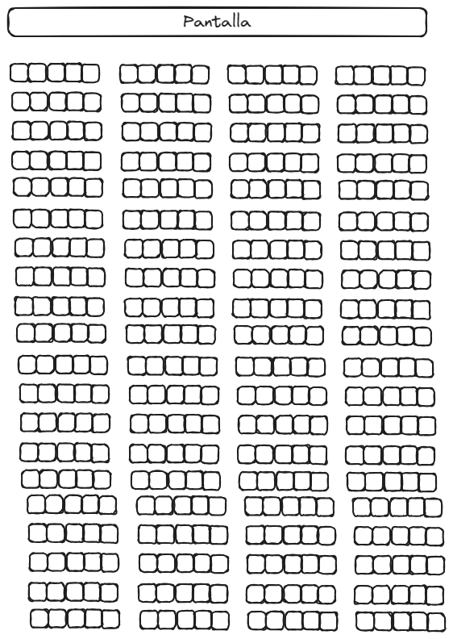
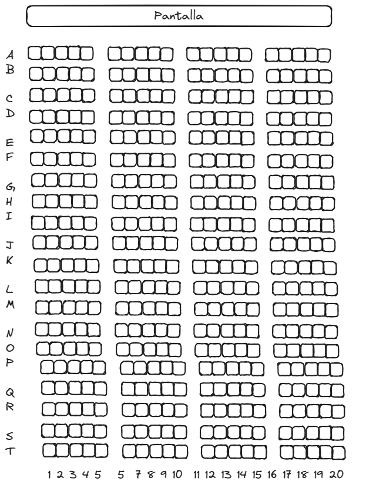

**Control de Entrada a un Bar**

Alita Cinemas es una cadena de cines que se extiende por todo Costa Rica. A pesar de ser una empresa exitosa, aún no tienen un sistema de reservación en línea (todos unos señores). Nuestro equipo de desarrolladores se está encargando del sistema de pagos, registro de usuarios y demás, sin embargo nos piden presentar un prototipo del sistema de reservaciones y para ello te hemos elegido ti. 

Este prototipo tendrá funcionalidades básicas, la cuales se irán mejorando con el tiempo. 

**Requerimientos**

Para el desarrollo del sistema puedes suponer que el tamaño de la sala es simétrico dónde en cada fila y en cada columna hay 20 butacas. Tal y como se muestra en la imagen

Ahora bien, cada **columna** tendrá un número asignado empezando desde 1 hasta 
20. De igual manera las **filas** tendrán una letra empezando por la A y treminando en la T ( la ñ no se incluye ).

Sabiendo esto, lo que se necesita es que el usuario pueda:

Seleccionar una butaca y que tenga la opción de reservarla. Si dicha butaca ya está reservada, deberá mostrar un mensaje que indique al usuario que no está disponible. 

Por aquí te dejo un vídeo de un truquito que te va a ayudar un montón.
